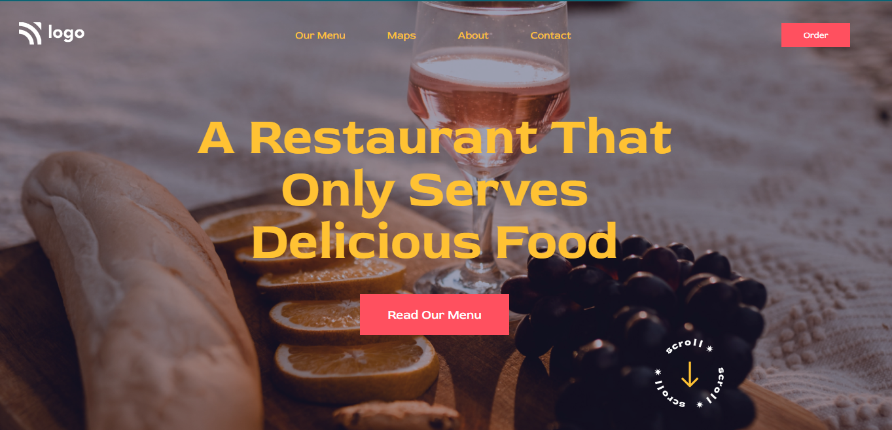

# Project-2:  **Restaurant Landing Page**
# Technology Used :  

##  **About** :- 
In this Project, i have used HTML and CSS to create a ***Restaurant*** website's Landing page.  

## [***Project-live-Link-->***](https://restaurantmainpage.netlify.app/) 

##  **Website Preview-->**

## Thank you for visiting.. also ckeck-out my next Projects & please share your valuable Feedback 👍👍    
